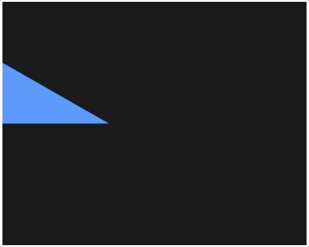

# zig-wasm-canvas

An example demonstrating Zig interacting with a canvas via JS. It is a port of
one of the official mozilla examples.

https://developer.mozilla.org/en-US/docs/WebAssembly

Forked from [raulgrell/zig-wasm-webgl](https://github.com/raulgrell/zig-wasm-webgl) and updated the code/build-command to work with latest Zig version.



## Setup

1.  [Install Zig](https://ziglang.org/learn/getting-started/#installing-zig)
2.  [Install Node.js](https://nodejs.org/en/download/)
3.  Install the **serve** package as a global `npm install -g serve`

## Compile

```bash
./build.sh
```

## Run

You'll need some solution for hosting a directory to serve up the index.html
and .wasm file.

```bash
serve
# Then open http://localhost:3000
# You should see a simple triangle in translating horizontally in a loop
```
